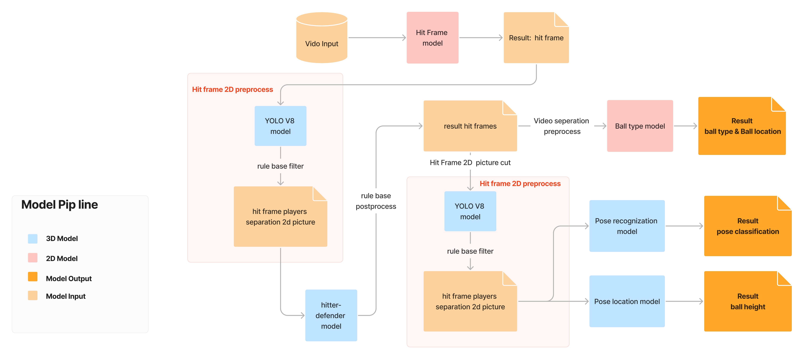

# AICUP2023-BadmintonCV

this repo collects team_3008 codes for AICUP2023 badminton competition 

## Environment
- OS: Windows10
- Programming language: Python3.9
- Packages:
  - Torch 1.7.1
  - Torchvision 0.8.2
  - Timm 0.4.12
  - scikit-learn 1.2.2
  - pandas 1.1.5
  - opencv-python 4.5.1.48

## Pretrained Models
- Efficientnet b0: imagenet weight
- Channel-Separated Convolutional Networks(CSN): Kinetics-400
- YOLO v8-x

## Flow chart

## Trained Model
- CSN based
  - hitframe model
  - balltype model
- Efficientnet based
  - pose classification model
  - pose location model

## Codes
- Training
  - [hitframe recognition](Train_3D_hitframe.ipynb)
  - [ball type recognition and ball location](Train_3D_Balltype.ipynb)
  - [hitter-defender recognition](train_efficient_5fold_hitter.ipynb)
  - [server-nonserver recognition](train_efficient_5fold_serve.ipynb)
  - [pose recognition](train_efficient_5fold_classification.ipynb)
  - [pose location](train_efficient_distance_with_augmentation.ipynb)
- Data Processing
  - [hitframe recognition](Test_3D_hitframe.ipynb)
  - [hitframe inference & 2D model inference](inference_classification.ipynb)
  - [balltype recognition and ball location](./Test_3D_Balltype.ipynb)
  - [player preprocess](yolo_preprocess.ipynb)
